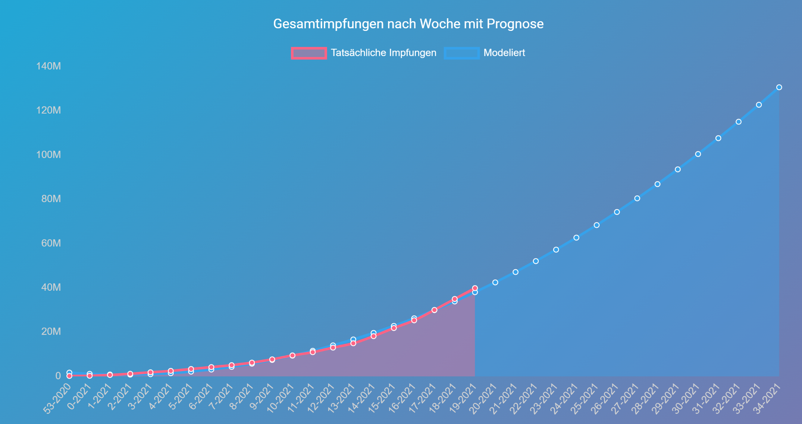

# [PartyTime](https://jhkessler.github.io/PartyTime/)


Prognostizierung und Darstellung des Impffortschritts in der Bundesrepublik Deutschland.


## Wie funktioniert die Prognostizierung?
Die Prognostizierung läuft über eine sogenannte "Best-Fit-Line", der Algorithmus sucht automatisch eine Funktion, welche die bisherige Impfentwicklung möglichst genau modelliert. Durch Einsetzen zukünftiger Daten in diese Funktion, kann man eine Vorraussage der Impfzahlen für die Zukunft machen.
Mit dieser Vorraussage und einer Schätzung der benötigten Impfquote für eine Herdenimmunität kann man ein vorraussichtliches Datum prognostizieren, an dem Discotheken wieder aufmachen.

### Run docker image
1. ```docker-compose up -d```
2. ``docker build -t partytime .``
3. ```docker-compose up -f docker-compose.prod.yml up```


### SSH into docker image with bash
1. ```docker-compose up -d```
2. ``docker build -t partytime .``
3. ``docker run --network partytime --entrypoint "/bin/sh" -it partytime``
